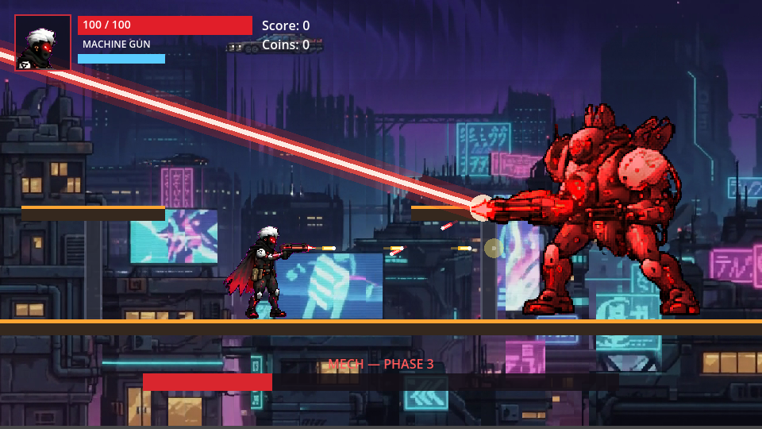

# Night Run

Night Run is a 2D side-scrolling shooter made in Godot 4.7. You run and
jump across a cyberpunk city, fight enemies with four different guns, and
finish the level with a boss fight against a mech.



## Play it

The game runs in a browser. No install needed.

Play link: add it here once the game is published on itch.io.

See `ITCH_UPLOAD.md` for how to publish it and get that link.

## Controls

| Key | Action |
|---|---|
| A / D or Left / Right | Move |
| Up | Aim up while firing |
| S or Down | Crouch on the ground. In the air, aim down while firing |
| Space | Jump (double jump works) |
| Left mouse button or Ctrl | Shoot |
| Shift | Raise your shield. Time it right and you deflect the shot back |
| Escape or P | Pause |

On a phone or tablet, on-screen buttons appear automatically.

## What is in this repo

```
game/       the Godot project. This is the actual game.
backend/    a small server that can record anonymous play data (off by default)
tools/      scripts used to build sound effects and clean up art
docs/       the screenshot used in this file
```

## Running it yourself

You need Godot 4.7.2. Open `game/project.godot` in the Godot editor and
press play.

To export a web build or an Android build, see `DEVELOPMENT.md`.

## Sound

All sound effects are generated by a script, not downloaded from anywhere.
See `tools/make_sfx.py`. Press M in the game to mute.

## Player data

The game can send basic play data to a small server, so we can see where
players get stuck. This is off by default. When it is on, the only things
sent are:

- a random id, made up by the game, not tied to your name or account
- which button you clicked, which item you picked up, where in the level
  you died or made progress

No name, no email, no location, no device info is ever collected. Full
details are in `PRIVACY.md`.

## More docs

- `DEVELOPMENT.md` how the game was built and how to work on it
- `PRIVACY.md` exactly what data is collected and why
- `HOSTING.md` how to host the web build and the backend
- `ANDROID_SETUP.md` how to build the Android version
- `ITCH_UPLOAD.md` how to publish to itch.io

## Status

The game is playable start to finish, including the boss fight. A few
things are still open:

- Tested on desktop browsers. The mobile layout has only been checked in a
  resized browser window, not on a real phone.
- The backend has never been connected to a real database.
- One planned enemy type still uses art borrowed from a turret enemy.
